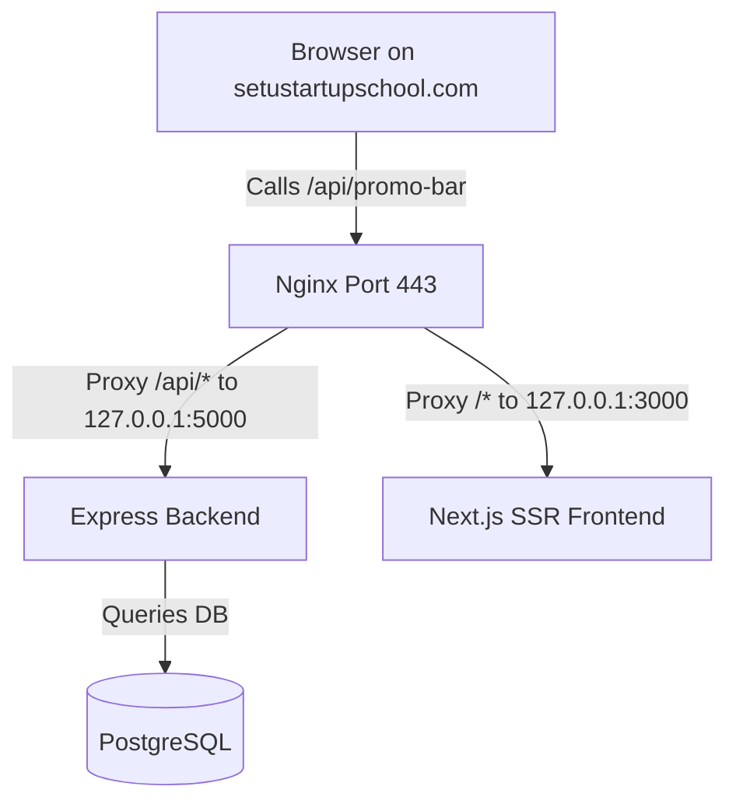

# Domain Migration & Troubleshooting Guide
**Domain Cutover**: `foundersschool.in` ➔ `setustartupschool.com`  
**Target Environment**: AWS EC2 (`13.200.49.118`) | Nginx Reverse Proxy | Node.js Express (5000) | Next.js (3000)  

---

## 1. Executive Summary & Issues Encountered

During the domain migration from `foundersschool.in` to `setustartupschool.com`, several interrelated client-side, server-side, and infrastructure errors were encountered and resolved.



### Key Issues Identified

| Issue | Symptom / Error Message | Root Cause |
|---|---|---|
| **1. SSL Common Name Mismatch** | `net::ERR_CERT_COMMON_NAME_INVALID foundersschool.in` | Client bundles contained hardcoded `foundersschool.in` URLs. The SSL certificate on the server only validated `setustartupschool.com`, causing the browser to reject cross-origin requests to the old domain. |
| **2. Next.js Build-Time Env Inlining** | Client making requests to old domain even after updating `.env` | Next.js statically bakes `NEXT_PUBLIC_*` variables into the JavaScript bundle at `npm run build` time. Modifying `.env` without rebuilding left old URLs baked in `.next/static/chunks/`. |
| **3. Content Security Policy (CSP) Image Blocking** | `Loading the image violates Content Security Policy directive...` | YouTube thumbnails (`*.ytimg.com`), user avatars (`*.googleusercontent.com`), and partner logos (`api.startupindia.gov.in`) were missing from `img-src` in `middleware.ts` and `next.config.ts`. |
| **4. 502 Bad Gateway on `/api/*`** | `GET /api/promo-bar 502 (Bad Gateway)` | The Express backend crashed on startup with `ReferenceError: PORT is not defined` at `server.js:1855`. Nginx could not establish a connection to `127.0.0.1:5000`. |
| **5. 500 Internal Server Error** | `GET /api/events 500 (Internal Server Error)` | Occurs when Prisma database client fails to query PostgreSQL due to missing database connection parameters or schema desync. |

---

## 2. Technical Remediation Implemented

### A. Transition to Same-Origin Relative API Endpoints
Instead of relying on hardcoded domains or `process.env.NEXT_PUBLIC_API_URL` for client-side fetches, all client components were converted to use relative paths (`/api/...`):
- In the browser, `/api/events` automatically requests `https://setustartupschool.com/api/events`.
- Nginx proxies `/api/*` directly to Express on `127.0.0.1:5000`.
- This eliminates CORS errors, SSL certificate mismatches, and domain dependency completely.

**Modified Client Components:**
- [`PromoBar.tsx`](file:///web/components/layout/PromoBar.tsx) ➔ `fetch('/api/promo-bar')`
- [`WorkshopPreview.tsx`](file:///web/components/sections/WorkshopPreview.tsx) ➔ `fetch('/api/events/pinned?_t=...')`
- [`EventsGallery.tsx`](file:///web/components/sections/EventsGallery.tsx) ➔ `fetch('/api/events')`
- [`Contact.tsx`](file:///web/components/sections/Contact.tsx) ➔ `fetch('/api/lead-sources')` & `fetch('/api/leads')`
- [`MentorCTA.tsx`](file:///web/components/sections/MentorCTA.tsx) ➔ `fetch('/api/leads')`
- [`DynamicContact.tsx`](file:///web/components/sections/dynamic/DynamicContact.tsx) ➔ `fetch('/api/leads')`
- [`OtpVerifyModal.tsx`](file:///web/components/sections/dynamic/OtpVerifyModal.tsx) ➔ `API = ''`
- [`DynamicCheckoutModal.tsx`](file:///web/components/sections/dynamic/DynamicCheckoutModal.tsx) ➔ `apiUrl = ''`
- [`DirectoryAdvisorBot.tsx`](file:///web/components/ecosystem/DirectoryAdvisorBot.tsx) ➔ `API = ''`
- [`AuthModal.tsx`](file:///web/components/ui/AuthModal.tsx) ➔ `apiUrl = ''`
- Tools & Directory search pages ➔ `/api/tools/...`

### B. Universal Server vs Client API URL Resolver
Created [`web/lib/api.ts`](file:///web/lib/api.ts):
```typescript
export function getApiBaseUrl(): string {
  if (typeof window !== 'undefined') {
    // In Browser: ALWAYS use relative paths (same origin)
    return '';
  }
  // In SSR / Node.js server: communicate directly via localhost
  return process.env.INTERNAL_API_URL || 'http://127.0.0.1:5000';
}
```
All Server Components ([`page.tsx`](file:///web/app/page.tsx), [`events/page.tsx`](file:///web/app/events/page.tsx), [`mentors/page.tsx`](file:///web/app/mentors/page.tsx), [`FooterLoader.tsx`](file:///web/components/layout/FooterLoader.tsx)) use `getApiBaseUrl()` to fetch data on the server without going through public DNS.

### C. Backend Server Startup Fix
In [`backend/server.js`](file:///backend/server.js#L16):
```javascript
const app = express();
const PORT = process.env.PORT || 5000;
app.disable('x-powered-by');
```
Resolved `ReferenceError: PORT is not defined` which was causing PM2 `tss-backend` to crash on startup.

### D. CORS & Security Policy Update
- **CORS ([`backend/server.js`](file:///backend/server.js#L40-L66))**: Dynamically validates and allows requests from `setustartupschool.com`, `www.setustartupschool.com`, and localhost.
- **CSP ([`web/middleware.ts`](file:///web/middleware.ts) & [`web/next.config.ts`](file:///web/next.config.ts))**:
  - `img-src`: Added `https://setustartupschool.com`, `https://*.setustartupschool.com`, `https://*.ytimg.com`, `https://*.googleusercontent.com`, `https://api.startupindia.gov.in`.
  - `connect-src`: Added `https://setustartupschool.com`, `https://*.setustartupschool.com`.

---

## 3. Server Deployment SOP (Step-by-Step)

Whenever updating code or environment variables on the EC2 production server, follow these exact steps:

### Step 1: SSH into EC2 Server
```bash
ssh -i /path/to/key.pem ubuntu@13.200.49.118
```

### Step 2: Pull Latest Git Commits
```bash
cd /home/ubuntu/Setu-TSS
git pull origin main
```

### Step 3: Verify Environment Files
Ensure `DATABASE_URL` and `PORT` are present in `backend/.env`:
```bash
# Check backend environment
cat backend/.env | grep -E "DATABASE_URL|PORT"

# Ensure frontend .env.production uses the new domain or relative configuration
sed -i 's/foundersschool.in/setustartupschool.com/g' web/.env.production 2>/dev/null || true
```

### Step 4: Rebuild Next.js Frontend
```bash
cd /home/ubuntu/Setu-TSS/web
npm run build
```

### Step 5: Restart PM2 Processes & Save State
```bash
cd /home/ubuntu/Setu-TSS
pm2 restart all
pm2 save
pm2 status
```

### Step 6: Test Backend Directly on Server
```bash
# Verify backend returns JSON (200 OK)
curl -i http://127.0.0.1:5000/api/promo-bar
curl -i http://127.0.0.1:5000/api/events
```

---

## 4. Verification Checklist

- [x] DNS A record points `setustartupschool.com` to `13.200.49.118`.
- [x] SSL certificate generated and active for `setustartupschool.com` and `www.setustartupschool.com`.
- [x] Nginx reverse-proxies `/api/` to port 5000 and `/` to port 3000.
- [x] Client components use relative `/api/...` paths.
- [x] Browser hard refresh (`Ctrl + Shift + R`) clears old cached JavaScript chunks.
- [x] Zero CORS, CSP, or SSL common name mismatch errors in browser DevTools.
